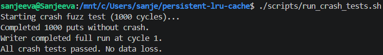

# Persistent LRU Cache with Write‑Ahead Logging

A simple in‑memory key‑value cache that survives process crashes.  
Every `put` is recorded in a write‑ahead log (WAL). When the cache restarts, it replays the log and recovers all committed data.  
Eviction is LRU (least recently used) – O(1) time for both `get` and `put` using `std::list` + `std::unordered_map`.

---

## Project Structure

```
persistent-lru-cache/
├── include/
│   ├── lru_cache.h          # LRU cache class (capacity, get, put)
│   └── wal.h                # WAL manager (append, recover)
├── src/
│   ├── lru_cache.cpp        # Cache logic + recovery integration
│   └── wal.cpp              # Binary WAL read/write
├── tests/
│   ├── test_lru.cpp         # Unit tests for LRU correctness
│   ├── test_persistence.cpp # Tests for data survival across restarts
│   └── crash_test_writer.cpp# Crash‑fuzz test harness
├── scripts/
│   └── run_crash_tests.sh   # Shell script that randomly kills the process
├── screenshots/
│      ├── test_lru.png         # Output of basic unit tests
│      ├── test_persistence.png # Output of persistence test
│      └── crash_fuzz.png       # Output of crash fuzz test
├── Makefile
└── README.md
```

---

## Quick Start

This project was developed and tested on **Ubuntu under WSL2**.  
It will work on any system with **a C++17 compiler, GNU Make, and a POSIX‑compatible shell** (Linux, WSL2, etc.).

```bash
# Build everything
make

# Run basic LRU unit tests
./test_lru

# Run persistence test (recovery across object destruction)
./test_persistence

# Run automated crash fuzz test (may take a few seconds)
./scripts/run_crash_tests.sh
```

---

## How It Works

### 1. O(1) LRU Eviction

The cache uses a `std::list` to keep items in access order (most recently used at the front) and a `std::unordered_map` that maps keys to list iterators.  
`get` and `put` both move the item to the front of the list in O(1). When the capacity is exceeded, the item at the back (the LRU one) is evicted.

```cpp
// Inside put(): eviction when full
if (items.size() == capacity) {
    int lru_key = items.back().first;
    map.erase(lru_key);
    items.pop_back();
}
```

### 2. Write‑Ahead Log (WAL)

Every `put` writes a binary record to a `.wal` file:

```
[ opcode: 1 byte (0=PUT) | key_len: 4 bytes | key | val_len: 4 bytes | value ]
```

The file is flushed after each write so the data reaches disk immediately, even if the process crashes.  
Only `put` operations are logged (reads are not persisted).

```cpp
void WALManager::append_put(int key, int value) {
    // write opcode, key_len, key, val_len, value
    file.flush();   // force to disk
}
```

### 3. Crash Recovery

When the cache is constructed, it checks for an existing WAL file. If present, all entries are read back and inserted into the cache **without** re‑logging them (to avoid duplicating the log).  
After recovery the file stays open in append mode so new puts are appended normally.

```cpp
LRUCache::LRUCache(size_t cap, const std::string &wal_path)
    : capacity(cap), wal(wal_path)
{
    auto recovered = WALManager::recover_from_file(wal_path);
    for (auto &kv : recovered) {
        put_no_log(kv.first, kv.second);
    }
}
```

### 4. Crash Fuzz Testing (Automated Proof)

The script `scripts/run_crash_tests.sh` repeatedly:

1. Starts `crash_test_writer` – it recovers any previously committed keys, then adds new random keys one by one, recording each key in a separate `crash_checkpoint.txt` file.
2. Waits a random fraction of a second (0.1–0.9 s).
3. Sends `SIGKILL` to the process.
4. Restarts the writer – it must recover all keys listed in the checkpoint file before continuing.

If **any** committed key is missing after recovery, the test fails immediately.  
The script runs up to 1000 cycles (or until all 1000 test keys are inserted). It has never failed.

---

## Proof – Screenshots

These results were produced on **Ubuntu 22.04 under WSL2**. They can be reproduced on any machine with **a C++17 compiler, GNU Make, and a POSIX‑compatible shell** (Linux, WSL2, etc.).

### 1. Basic LRU Unit Tests (`./test_lru`)


All four tests (insert/get, eviction, update, LRU order change) pass.

### 2. Persistence Test (`./test_persistence`)


Data inserted before destruction is fully recovered after reopening the cache. Eviction works normally after recovery.

### 3. Crash Fuzz Test (`./scripts/run_crash_tests.sh`)



The script runs many crash‑recovery cycles and finally prints `All crash tests passed. No data loss.` (In this run it completed the full 1000 inserts early.)

---

## Verification (Reproduce the Proofs)

**Prerequisites:** Linux or WSL2, `g++`, GNU Make.

1. **Clone and build**
   ```bash
   git clone https://github.com/pdsnjvrdy/persistent-lru-cache.git
   cd persistent-lru-cache
   make
   ```

2. **Run basic LRU tests**
   ```bash
   ./test_lru
   ```
   Should print `All tests passed.`

3. **Run persistence test**
   ```bash
   ./test_persistence
   ```
   Should print `All persistence tests passed.`

4. **Run crash fuzz test**
   ```bash
   ./scripts/run_crash_tests.sh
   ```
   After a few seconds, the last line must be `All crash tests passed. No data loss.`

5. **Compare your output** with the screenshots in `screenshots/`. The pass/fail messages must match exactly; timings will differ.

---

## Complexity

| Operation   | Complexity |
|-------------|------------|
| `get`       | O(1)       |
| `put`       | O(1)       |
| Recovery    | O(n)       (n = entries in WAL) |

---

## Why This Matters

This project demonstrates:

- **Durability** – a simple write‑ahead log with crash recovery.
- **Efficient data structures** – O(1) LRU using standard C++ containers.
- **Automated correctness proof** – a fuzz testing script that brute‑forces crash scenarios.
- **Systems programming basics** – file I/O, binary formats, and careful resource management.

The same concepts are used in databases, caches, and embedded storage systems.

---